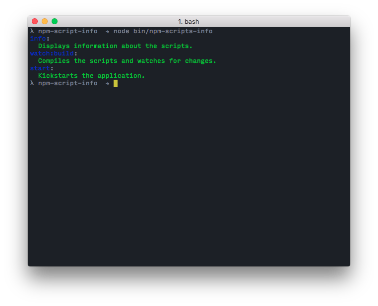

## npm-scripts-info [](https://npmjs.org/package/npm-scripts-info?style=flat-square) [](https://travis-ci.org/srph/npm-scripts-info?branch=master)
Display the description of your npm scripts.

## Installation
```bash
npm i -S npm-scripts-info
```

## Usage

### Using the `scripts-info` property
Add the descriptions (`scripts-info`) to your `package.json`. Afterwards, add `npm-scripts-info` to your scripts.
```json
{
  "name": "my-project",
  "scripts": {
  	"info": "npm-scripts-info"
  },
  "scripts-info": {
  	"info": "Displays information about the scripts.",
  	"watch:build": "Compiles the scripts and watches for changes.",
  	"start": "Kickstarts the application."
  }
}
```
Finally, run `npm run info`.

### Usings scripts prefixed with `?`

For modules with dozens of scripts it might be a better option to store the descriptions near the commands. `npm-scripts-info` allows to store the scripts descriptions in the `scripts` property. In order to add a script description, just prefix its name with `?`.

```json
{
  "name": "my-project",
  "scripts": {
    "?info": "Display information about the scripts.",
    "info": "npm-scripts-info",

    "?watch:build": "Watch codebase, trigger build when source code changes",
    "watch:build": "webpack --watch",

    "?start": "echo Kickstarts the application.",
    "start": "node index"
  }
}
```

Have you noticed the `echo` command in the `start` description? Hence the descriptions are inside the script property, they can be called using `npm run`. By adding the `echo` command to the description properties you can make valid scripts from them. Therefore, running `npm run ?start` will print the description of the `start` script. And the great thing is, `npm-scripts-info` is smart enough to fetch the description from the `echo` command!

**NOTE:** The prefixed commands will be looked up for descriptions only if the `package.json` doesn't have a `scripts-info` property.

## Custom Reporters
You can customize the output by specifying a reporter.
```bash
npm-scripts-info -r=my-reporter
```
You can check the [default reporter](lib/reporter.js) to get the gist of how it works. It's very simple.

**Note**: If you're publishing your own reporter, please prefix it with `npm-scripts-info` (e.g., `npm-scripts-info-my-reporter`) for searchability.

## Using the JavaScript API

You can fetch the scripts descriptions from a `package.json` in JavaScript.

``` js
var getScriptsInfo = require('npm-scripts-info');
var readPkgUp = require('read-pkg-up');

readPkgUp
  .then(function(result) {
     var scriptsInfo = getScriptsInfo(result.pkg);
     console.log(result.scriptsInfo);
     //> { test: 'Run the tests' }
  });
```

## Default Descriptions

Some of the npm scripts are standardized. `npm-scripts-info` provides default descriptions for them, if no custom description specified in `scripts-info`.

* **info** - Display information about the scripts
* **start** - Kickstart the application
* **test** - Run the tests
* **build** - Build the package
* **watch** - Watch codebase, trigger build when source code changes
* **cover** - Execute test coverage

## Preview

